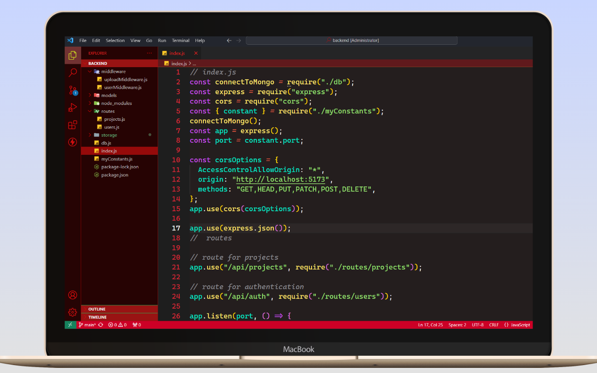

# Codeify Color Theme for Visual Studio Code

`Version 1.0.2`

## Description

The `"Codeify"` extension provides a set of stylish color themes for Visual Studio Code. Whether you prefer a subtle italic style, a deep italic look, or the boldness of Optimus Prime, Codeify has you covered!

## Themes

- Codeify Italic
- Codeify Deep Italic
- Codeify Optimus Prime
- Codeify Dark Matter
- Codeify Dark Berry

## Demos

- **`Codeify Italic`**

  `Html`
  

  `Javascript`
  

  `php`
  

- **`Codeify Deep Italic`**

  `Html`
  

  `javaScript`
  

  `php`
  

- **`Codeify Optimus Prime`**

  

  

- **`Codeify Dark Matter`**

  `Html`
  

  `Javascript`
  

  `php`
  

- **`Codeify Dark Berry`**

  `html`
  

  `Javascript`
  

  `php`
  

## Installation

1. Open Visual Studio Code.
2. Go to Extensions (Ctrl+Shift+X).
3. Search for "Codeify" and install the extension.
4. Select your preferred theme from the settings.

## Author

- **Md Saymum Islam Siyam**

## Version History

- **Version 1.0.2**
  - Added new themes: "Codeify Dark Matter" and "Codeify Dark Berry"
  - Updated existing theme: "Codeify Deep Italic" (details of changes go here)

## License

This extension is licensed under the MIT License. See LICENSE for details.

[License](LICENSE)

Happy coding! 🚀
